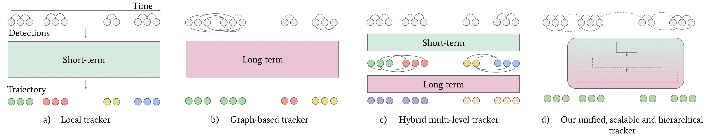
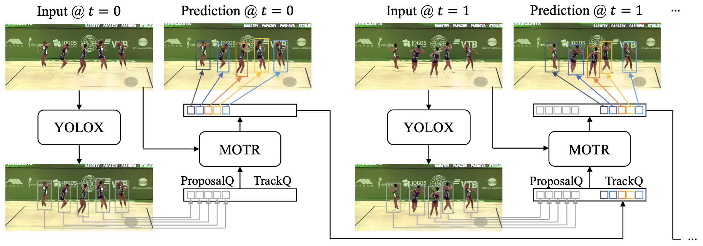
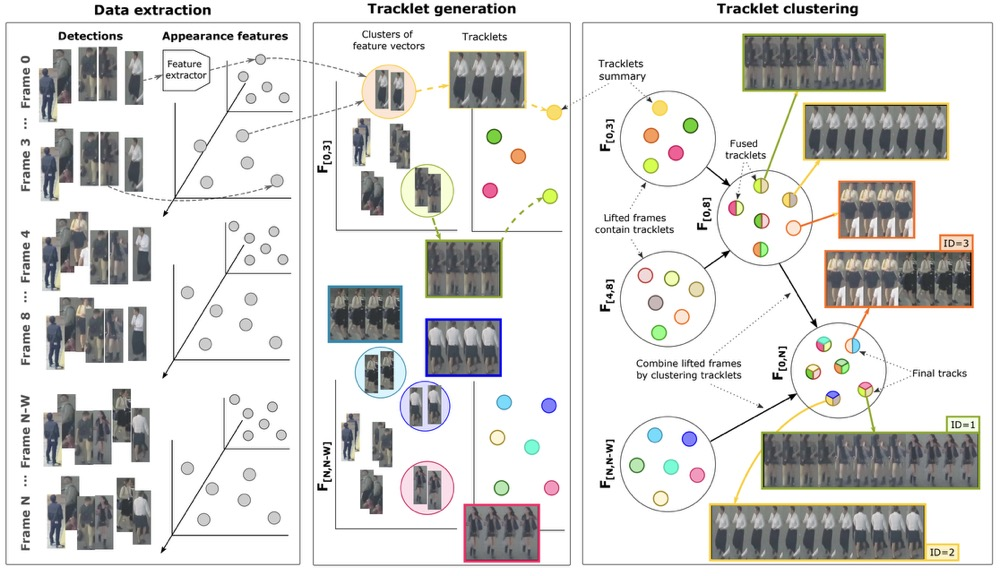

# multiObjectTrackingPapers

- 多目标跟踪论文算法整理
- multiObjectTrackingPapers is dedicated to organizing research papers and code related to object tracking

<div align="center">

## Paper List

| Year | Title | Intro | Description  | Code
|:----:|:----:|:----:|:----:|:----:|
| 2023 | [SUSHI](https://arxiv.org/abs/2212.03038) |  | Unifying Short and Long-Term Tracking with Graph Hierarchies | [[Github](https://github.com/dvl-tum/SUSHI)]|
| 2023 | [MOTRv2](https://arxiv.org/abs/2211.09791) |  | MOTRv2: Bootstrapping End-to-End Multi-Object Tracking by Pretrained Object Detectors | [[Github](https://github.com/megvii-research/MOTRv2)]|
| 2022 | [MOT_FCG](https://arxiv.org/abs/2210.03355) | Multiple Object Tracking from appearance by hierarchically clustering tracklets | Multiple Object Tracking from appearance by hierarchically clustering tracklets | [[Github](https://github.com/NII-Satoh-Lab/MOT_FCG)]|
| 2023 | [OC-SORT](https://arxiv.org/abs/2203.14360) |  | Observation-Centric SORT: Rethinking SORT for Robust Multi-Object Tracking| [[Github](https://github.com/noahcao/OC_SORT)]|
| 2023 | [StrongSORT](https://arxiv.org/abs/2202.13514) |  | StrongSORT: Make DeepSORT Great Again | [[Github](https://github.com/dyhBUPT/StrongSORT)]|
| 2022 | [MOTR](https://arxiv.org/abs/2105.03247) |  | MOTR: End-to-End Multiple-Object Tracking with TRansformer | [[Github](https://github.com/megvii-research/MOTR)]|
| 2017 | [deep_sort](https://arxiv.org/abs/1703.07402) | | Simple Online and Realtime Tracking with a Deep Association Metric (Deep SORT) | [[Github](https://github.com/nwojke/deep_sort)]|
| 2018 | [MOTDT](https://arxiv.org/pdf/1809.04427) | - | Real-time Multiple People Tracking with Deeply Learned Candidate Selection and Person Re-identification  | [[Github](https://github.com/longcw/MOTDT)]|
| 2019 | [Real-Time Multi-Object Tracking]([https://arxiv.org/abs/2202.13514](https://arxiv.org/pdf/1909.12605v1)) |assets/MOTA-IDF1-HOTA.png) | Towards Real-Time Multi-Object Tracking | [[Github](https://github.com/Zhongdao/Towards-Realtime-MOT)]|
| 2020 | [CenterTrack](https://arxiv.org/pdf/2004.01177) | -| CenterTrack : Tracking Objects as Points | [[Github](https://github.com/xingyizhou/CenterTrack)]|
| 2021 | [TransTrack](https://arxiv.org/pdf/2012.15460) | - | Transformer-based : TransTrack: Multiple Object Tracking with Transformer | [[Github](https://github.com/PeizeSun/TransTrack)]|
| 2021 | [FairMOT](https://arxiv.org/pdf/2004.01888) |-  | FairMOT: On the Fairness of Detection and Re-Identification in Multiple Object Tracking | [[Github](https://github.com/ifzhang/FairMOT)]|
| 2022 | [Deep OC-SORT](https://arxiv.org/pdf/2302.11813) | - | Deep OC-SORT: Multi-Pedestrian Tracking by Adaptive Re-Identification | [[Github](https://github.com/GerardMaggiolino/Deep-OC-SORT/)]|
| 2022 | [ByteTrack](https://arxiv.org/pdf/2110.06864) | - | ByteTrack: Multi-Object Tracking by Associating Every Detection Box | [[Github](https://github.com/ifzhang/ByteTrack)]|
| 2023 | [BOT-SORT](https://arxiv.org/abs/2206.14651) | - | StrongSORT: Make DeepSORT Great Again | [[Github](https://github.com/NirAharon/BOT-SORT)]|
| 2023 | [StrongSORT](https://arxiv.org/abs/2202.13514) | - | StrongSORT: Make DeepSORT Great Again | [[Github](https://github.com/dyhBUPT/StrongSORT)]|

    
</div>
</br>


<div align="center"></div>

</br>


## DanceTrack Dataset

- [DanceTrack - gitHub 主页](https://github.com/DanceTrack/DanceTrack)
- [DanceTrack: Multi-Object Tracking in Uniform Appearance and Diverse Motion](https://arxiv.org/abs/2111.14690)

<p align="center">   </p>


## Agreement

- The code of multiObjectTrackingPapers is released under the MIT License.  

## Learn more
<div align="left">
    
- [ ]  [墨理学AI - CSDN](https://positive.blog.csdn.net/)
- [ ] 随时更新


</div>
</br>  

## Acknowledgement  
 
- The readme here mainly refers to [DanceTrack - gitHub 主页](https://github.com/DanceTrack/DanceTrack)
- Thank you to all the visitors, thank you for lighting up for me
- Good luck to everyone


## Citation

DanceTrack

```BibTeX

@article{peize2021dance,
  title   =  {DanceTrack: Multi-Object Tracking in Uniform Appearance and Diverse Motion},
  author  =  {Peize Sun and Jinkun Cao and Yi Jiang and Zehuan Yuan and Song Bai and Kris Kitani and Ping Luo},
  journal =  {arXiv preprint arXiv:2111.14690},
  year    =  {2021}
}

```
