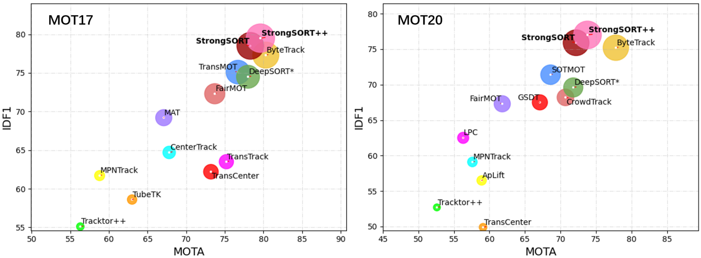

# DanceTrack

多目标跟踪论文算法整理.

<div align="center">
    
## Paper List

| Year | Title | Intro | Description  | Code
|:----:|:----:|:----:|:----:|:----:|
| 2023 | [SUSHI](https://arxiv.org/abs/2212.03038) |  | Unifying Short and Long-Term Tracking with Graph Hierarchies | [[Github](https://github.com/dvl-tum/SUSHI)]|
| 2023 | [MOTRv2](https://arxiv.org/abs/2211.09791) |  | MOTRv2: Bootstrapping End-to-End Multi-Object Tracking by Pretrained Object Detectors | [[Github](https://github.com/megvii-research/MOTRv2)]|
| 2022 | [MOT_FCG](https://arxiv.org/abs/2210.03355) | Multiple Object Tracking from appearance by hierarchically clustering tracklets | Multiple Object Tracking from appearance by hierarchically clustering tracklets | [[Github](https://github.com/NII-Satoh-Lab/MOT_FCG)]|
| 2023 | [OC-SORT](https://arxiv.org/abs/2203.14360) |  | Observation-Centric SORT: Rethinking SORT for Robust Multi-Object Tracking| [[Github](https://github.com/noahcao/OC_SORT)]|
| 2023 | [StrongSORT](https://arxiv.org/abs/2202.13514) |  | StrongSORT: Make DeepSORT Great Again | [[Github](https://github.com/dyhBUPT/StrongSORT)]|
| 2022 | [MOTR](https://arxiv.org/abs/2105.03247) |  | MOTR: End-to-End Multiple-Object Tracking with TRansformer | [[Github](https://github.com/megvii-research/MOTR)]|
| 2017 | [deep_sort](https://arxiv.org/abs/1703.07402) | | Simple Online and Realtime Tracking with a Deep Association Metric (Deep SORT) | [[Github](https://github.com/nwojke/deep_sort)]|
| 2023 | [StrongSORT](https://arxiv.org/abs/2202.13514) | assets/MOTA-IDF1-HOTA.png) | StrongSORT: Make DeepSORT Great Again | [[Github](https://github.com/dyhBUPT/StrongSORT)]|
| 2019 | [Real-Time Multi-Object Tracking]([https://arxiv.org/abs/2202.13514](https://arxiv.org/pdf/1909.12605v1)) |assets/MOTA-IDF1-HOTA.png) | Towards Real-Time Multi-Object Tracking | [[Github](https://github.com/Zhongdao/Towards-Realtime-MOT)]|
| 2020 | [CenterTrack](https://arxiv.org/pdf/2004.01177) | -| CenterTrack : Tracking Objects as Points | [[Github](https://github.com/xingyizhou/CenterTrack)]|
| 2021 | [TransTrack](https://arxiv.org/pdf/2012.15460) | - | Transformer-based : TransTrack: Multiple Object Tracking with Transformer | [[Github](https://github.com/PeizeSun/TransTrack)]|
| 2021 | [FairMOT](https://arxiv.org/pdf/2004.01888) |-  | FairMOT: On the Fairness of Detection and Re-Identification in Multiple Object Tracking | [[Github](https://github.com/ifzhang/FairMOT)]|
| 2022 | [Deep OC-SORT](https://arxiv.org/pdf/2302.11813) | - | Deep OC-SORT: Multi-Pedestrian Tracking by Adaptive Re-Identification | [[Github](https://github.com/GerardMaggiolino/Deep-OC-SORT/)]|
| 2023 | [StrongSORT](https://arxiv.org/abs/2202.13514) | - | StrongSORT: Make DeepSORT Great Again | [[Github](https://github.com/dyhBUPT/StrongSORT)]|

    
</div>
</br>

<div align="left">
    
- [0]  [墨理学AI - CSDN](https://positive.blog.csdn.net/)
- [ ] https:xxx
- [ ] Add delight to the experience when all tasks are complete :tada:
    
</div>
</br>

<div align="center"></div>

</br>

## Paper (CVPR2022)
[DanceTrack: Multi-Object Tracking in Uniform Appearance and Diverse Motion](https://arxiv.org/abs/2111.14690)


## News
- (05/2023) We list some awesome research papers and projects here you may find interesting. Welcome new pull request to add new links !
- (04/2022) We are organizing [Multiple Object Tracking and Segmentation in Complex Environments Workshop](https://motcomplex.github.io/), ECCV 2022. 


## DanceTrack Dataset
Download the dataset from [Google Drive](https://drive.google.com/drive/folders/1ASZCFpPEfSOJRktR8qQ_ZoT9nZR0hOea?usp=sharing) or [Baidu Drive](https://pan.baidu.com/s/19O3IvYNzzrcLqlODHKYUwA) (code:awew).


<p align="center">   </p>

<p align="center">   </p>
  
  


## Agreement
- The annotations of DanceTrack are licensed under a [Creative Commons Attribution 4.0 License](https://creativecommons.org/licenses/by/4.0/).
- The dataset of DanceTrack is available for **non-commercial** research purposes only.
- All videos and images of DanceTrack are obtained from the Internet which are not property of HKU, CMU or ByteDance. These three organizations are not responsible for the content nor the meaning of these videos and images.
- The code of DanceTrack is released under the MIT License.  


  

## Acknowledgement  
 
The evaluation metrics and code are from [MOT Challenge](https://motchallenge.net/) and [TrackEval](https://github.com/JonathonLuiten/TrackEval). The inference code is from [ByteTrack](https://github.com/ifzhang/ByteTrack). The joint-training code is modified from [CenterTrack](https://github.com/xingyizhou/CenterTrack) and [CenterNet](https://github.com/xingyizhou/CenterNet), where the instance segmentation code is from [CenterNet-CondInst](https://github.com/CaoWGG/CenterNet-CondInst). Thanks for their wonderful and pioneering works !
  
  

## Citation

If you use DanceTrack in your research or wish to refer to the baseline results published here, please use the following BibTeX entry:

```BibTeX

@article{peize2021dance,
  title   =  {DanceTrack: Multi-Object Tracking in Uniform Appearance and Diverse Motion},
  author  =  {Peize Sun and Jinkun Cao and Yi Jiang and Zehuan Yuan and Song Bai and Kris Kitani and Ping Luo},
  journal =  {arXiv preprint arXiv:2111.14690},
  year    =  {2021}
}

```
